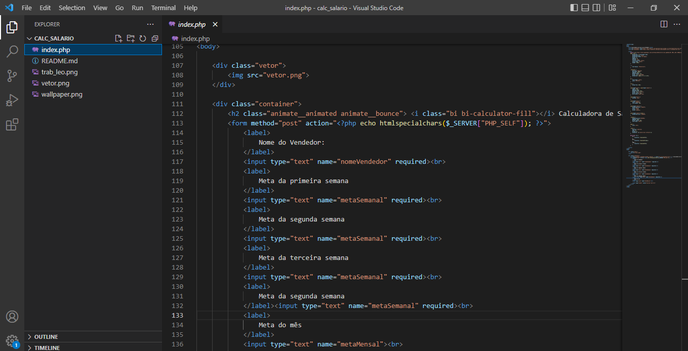

# 💶Calculadora de salario para Vendedores

 ## **Projeto desenvolvido pelo técnico do Marista com o intuito de calcular o salário de vendedores💸**
 
| 🧠 Lógica  | 
| ----------- |
| Salário-mínimo garantido para todos os vendedores |
|  Meta semanal desafiadora de 20 mil reais, totalizando 80 mil reais por mês por vendedor.|
| Bônus de 1% sobre a meta semanal atingida ou excedida.|
| Bônus adicional de 5% sobre o excedente da meta semanal superada.|
| Bônus de 10% sobre o excedente da meta mensal para os vendedores que atingem todas as metas semanais.|

### Tecnologias Utilizadas
- 📜Html
- 🐘Php
- 🎨CSS
- 🖌️figma

# Demonstração do projeto

